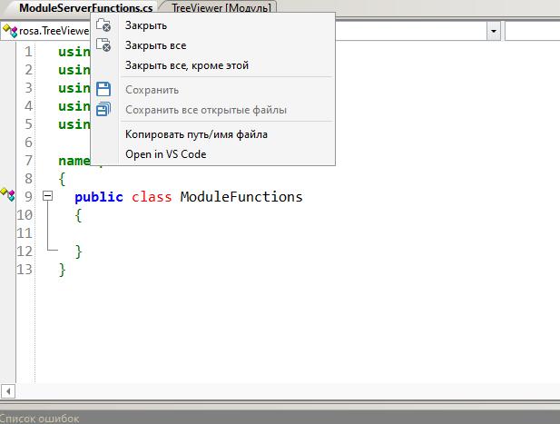
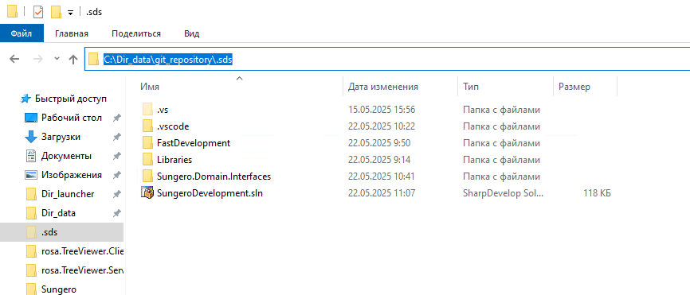
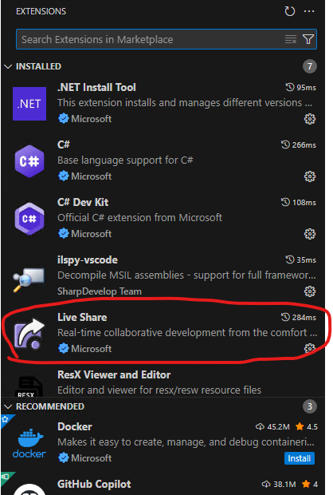
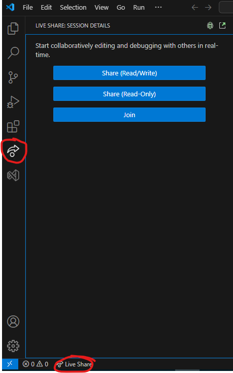
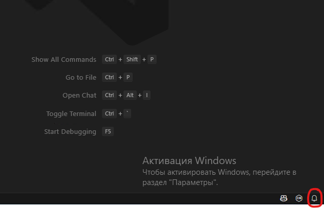

# DDS OpenVSCode Addin Source

Исходники для работы с плагинами sharpDevelop 4.4 и файлы плагина Opening_external_editor

## Инструкция для плагина Opening_external_editor
### Установка
Перед установкой плагина, рекомендуется проверить версию DDS, тестирование производилось на версии Directum RX 4.12.44.0. 
Для установки требуется добавить два файла, в каталог Sungero по пути <i>Папка с лаунчером\etc\_builds\developmentstudio\AddIns\Sungero:</i>
- Opening_external_editor.addin;
- Opening_external_editor.dll.
После добавления, файлы при запуске сами пройдут инициализацию. 
### Использование
Плагин, позволяет открывать код в любом стороннем редакторе.
Важно, по умолчанию сторонний редактор запрограммирован VS Code, который должен быть обозначен системой в PATH.
Чтобы открыть код в стороннем редакторе, нужно открыть код как обычно в DDS, затем вызвать контекстное меню (нажать правой кнопкой по открытому окну DDS). В контекстном меню нажать кнопку Open in VS Code. После этого если не был запущен VS Code, он запустится, если уже был открыт, добавит вкладку файла. Пример с кнопкой:

### Добавление решения в редактор VS Code
Для того чтобы у пользователей была возможность редактировать код, также как и в DDS, рекомендуется подключить решение проекта. Для добавления необходимо перед открытием кода по кнопке в DDS, добавить решение через Open Folder и найти папку по пути C:\Dir_data\git_repository, в которой будет находится скрытая папка .sds, ее следует выбрать, чтобы решение добавилось в редактор и ссылки на базовые решения.

### Применение плагина для совместной работы в редакторе VS Code
Чтобы использовать возможности совместного редактирования, у пользователей должен быть установлен плагин Live Share.

После этого можно нажать кнопку Live Share внизу редактора, либо перейти на вкладку и нажать там и передать ссылку, тем с кем будет взаимодействие

После старта коллаборации, когда подключаемые пользователи к сессии будут заходить, необходимо выдать им доступ, он будет находится в правом нижнем углу во вкладке уведомлений

После подключения, инициатор коллаборации открывает нужные ему участки кода в DDS, затем нажимает кнопку Open in VS Code, и окна с редактором открывается в общей сессии со всеми участниками коллаборации.
